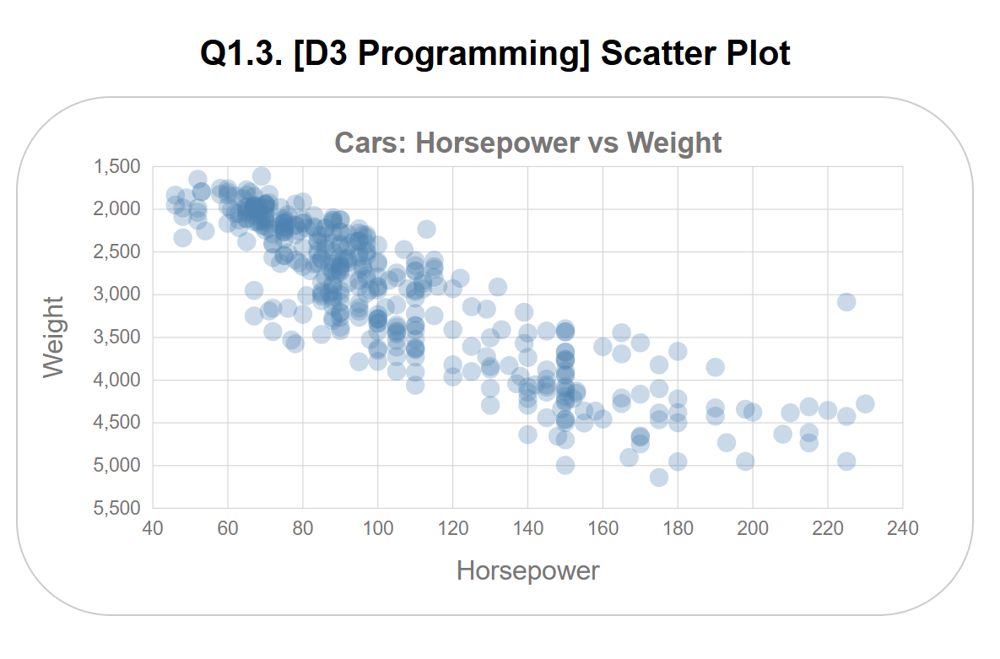

# Scatter Plot Visualization

This project is part of an ongoing exploration of data visualization using D3.js. Specifically, it focuses on creating a scatter plot that visualizes the relationship between car horsepower and weight using data from `auto-mpg.csv`.

## Overview
The visualization represents car horsepower vs. weight, showing data points for different cars. This project aims to practice building a scatter plot and styling it with D3.js, based on the learning objectives from Tutorials 0, 1, and 2.

### Key Features
- Uses D3.js to load and visualize data from a CSV file.
- Creates a scatter plot with `960px` width and `500px` height.
- Displays a grid using extended tick lines, with rounded scales using `.nice()` for both x and y axes.
- Adds appropriate labels for the x-axis (Horsepower) and y-axis (Weight).
- All data points (cars) are represented with a circle of `10px` radius and `0.3` opacity to help visualize overlapping points.

## Data
The dataset used is `auto-mpg.csv`. This CSV file contains information about various cars, such as:
- `horsepower`: Horsepower of the car.
- `weight`: Weight of the car.

### Sample Data Columns:
```
mpg, cylinders, displacement, horsepower, weight, acceleration, year, origin, name
```
For this scatter plot, we specifically use `horsepower` and `weight` columns.

## Steps to Create the Visualization
1. **Set Up the SVG Canvas**:
   - Defined an SVG element with `960px` width and `500px` height.
   - Set up the margins for the chart to create space for labels and title.

2. **Load and Format the Data**:
   - Loaded the CSV file using `d3.csv()`.
   - Formatted the `horsepower` and `weight` columns to numerical values.
   - Filtered out any rows with missing values to ensure all data points are valid.

3. **Define Scales and Axes**:
   - Created a **linear x-scale** for horsepower and a **linear y-scale** for weight, ensuring they matched the scatter plot's expected dimensions.
   - Both scales were extended with `.nice()` to round the limits for better tick mark alignment.
   - Added an x-axis (bottom) and y-axis (left), with gridlines using extended tick lines.

4. **Plot Data Points**:
   - Used `g.selectAll('circle').data(data)` to bind the data to circle elements.
   - Set circle attributes such as `cx`, `cy`, `r` (radius), and `opacity` to represent the car attributes visually.

5. **Add Labels and Titles**:
   - Added the chart title "Cars: Horsepower vs Weight" centered at the top.
   - Added labels for the x-axis and y-axis, with proper positioning and rotation for readability.

## Screenshot (Final Output)



This visualization effectively conveys the relationship between horsepower and weight for different cars, with overlapping points being clearly visible due to the opacity setting.

## Usage
To view the scatter plot:
1. Clone this repository.
2. Open the `index.html` file in your browser.
3. Make sure the `auto-mpg.csv` is located in the same directory.

## Requirements
- **D3.js v7**: The visualization uses D3.js version 7.
- **HTML/CSS**: A basic HTML file (`index.html`) and a CSS file (`styles.css`) are used to set up the page and add styles.

## Conclusion
This project demonstrates the process of creating a scatter plot in D3.js using real data. It shows how to load data from a CSV, plot it accurately, and add stylistic elements to make the visualization effective and visually appealing.